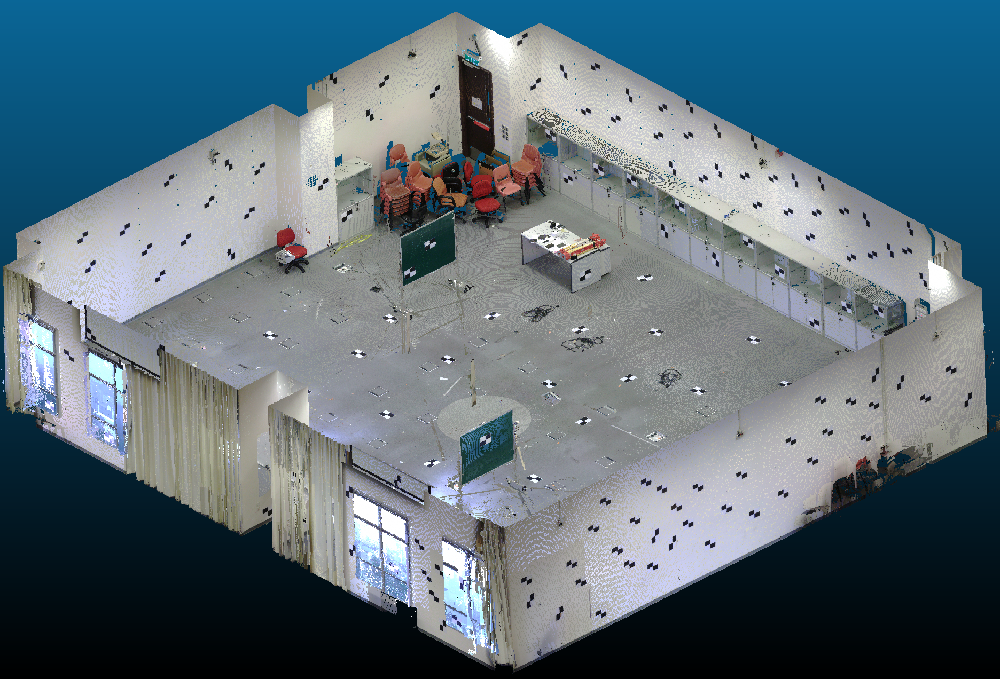
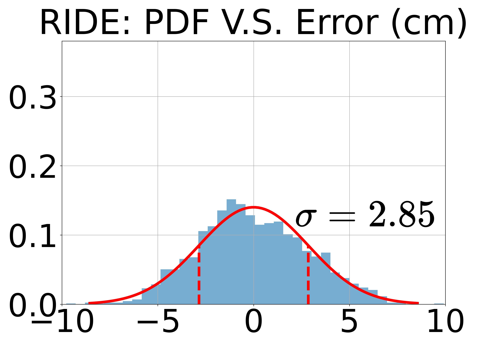
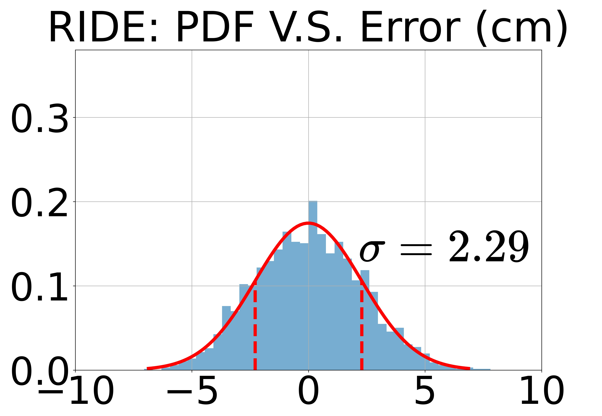
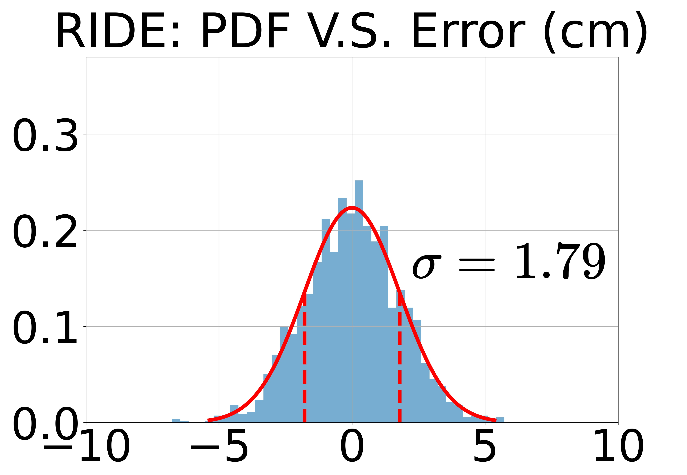
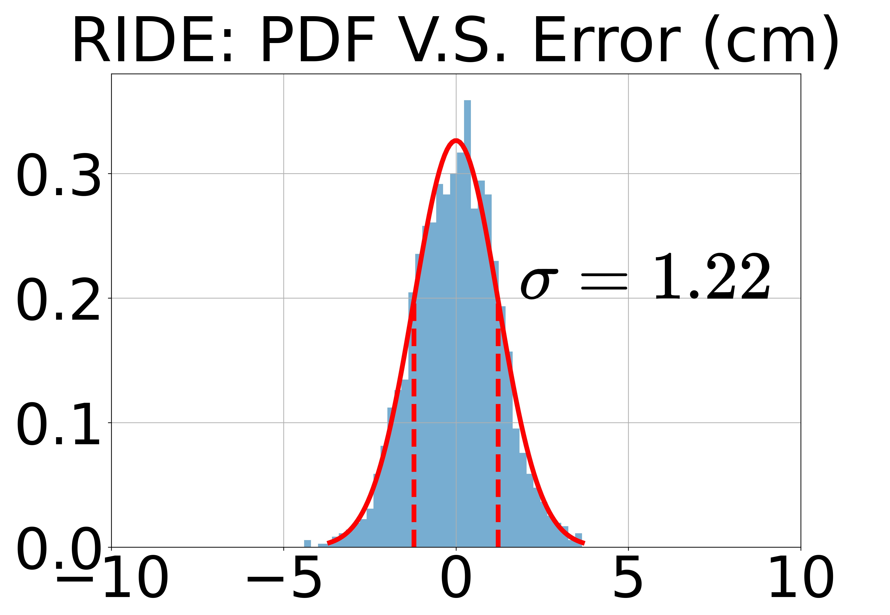
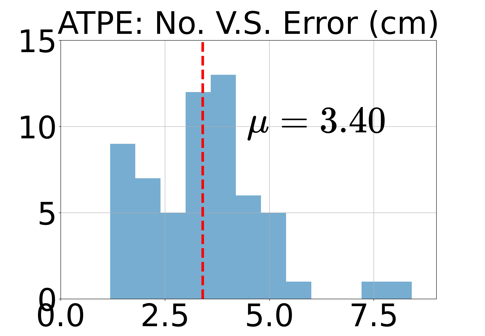
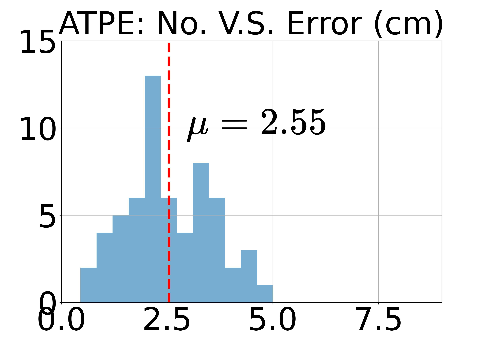
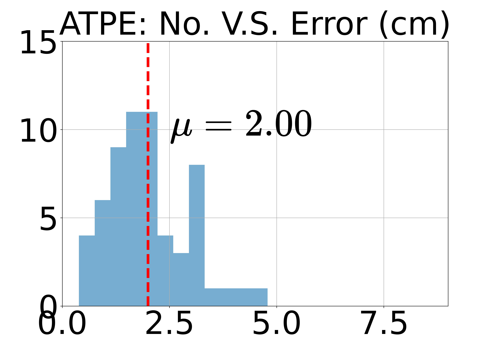
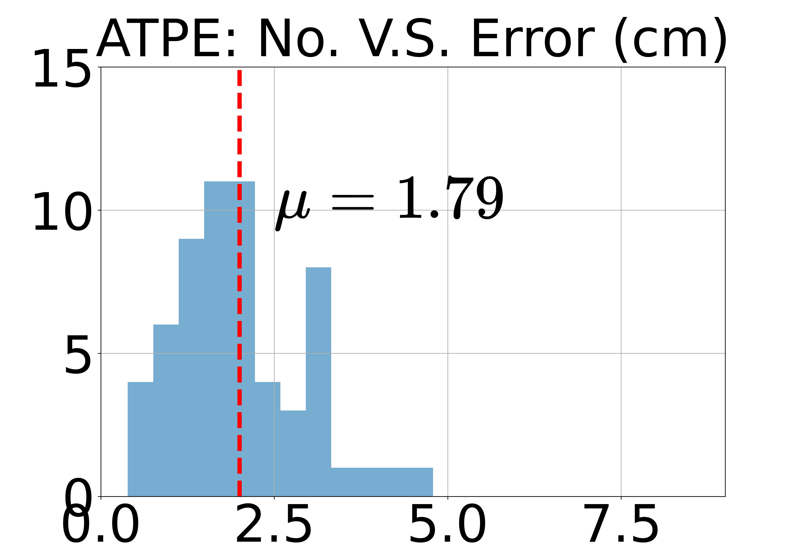

[](https://creativecommons.org/licenses/by-nc-sa/4.0/legalcode)

# Hysteretic Mapping and Corridor Semantic Modeling Using Mobile LiDAR Systems

This repo shares the dataset, sample results, and benchmark devkit used in the paper. 

**Hysteretic Mapping and Corridor Semantic Modeling Using Mobile LiDAR Systems** 

**Authors: Pengxin Chen, Zhipeng Luo and Wenzhong Shi**


## 1. Dataset	
The dataset can be found 
<a href="https://connectpolyu-my.sharepoint.com/:f:/g/personal/19046315r_connect_polyu_hk/EmW-3AQkKc5EmHMktpUFLRMBbkMGB8QYeTzIWXHpZTRF2g?e=vI8qKy">here</a>. 

<p align="center">  </p>

### 1) Terrestrial laser scanning

The ```Calibration_room/Terrestrial``` folder contains ground-truth data logged by a terrestrial laser scanner.

```TLS_with_target_coordinates.bin``` is saved by the [CloudCompare](https://github.com/cloudcompare/cloudcompare) software.
<p align="center">  </p>

The centroid coordinates of these black-and-white targets have been extracted manually in the ```TLS_groudtruth/tls_target.csv``` file.

### 2) Handheld laser scanning

The ```Calibration_room/Handheld``` folder contains a rosbag file logged by a hand-held Velodyne VLP16. The bag file can be used to generate a dense point cloud map by a SLAM algorithm.

The point format follows the definition in [velodyne-ros-driver](https://github.com/ros-drivers/velodyne), namely
```angular2html
struct PointXYZIRT
{
    PCL_ADD_POINT4D
    PCL_ADD_INTENSITY;
    uint16_t ring;
    float time;
    EIGEN_MAKE_ALIGNED_OPERATOR_NEW
} EIGEN_ALIGN16;
POINT_CLOUD_REGISTER_POINT_STRUCT (PointXYZIRT,
                                   (float, x, x) (float, y, y) (float, z, z) (float, intensity, intensity)
                                   (std::uint16_t, ring, ring) (float, time, time))
```


### 3) Corridor training data

The ```Calibration_room/Terrestrial``` folder contains training data for corridor semantic segmentation. Each sample file has five columns, and the definition of columns is:
```angular2html
x y z intensity class_id
```


## 2. DevKit	

We provide a devkit to benchmark ```MLS_sample_results``` against ```TLS_groundtruth``` on the ```Calibration_room``` dataset.

In ```benchmark.py```, mapping errors are computed on the ```RIDE``` and ```ATPE``` metrics. 

For the definition of ```RIDE``` and ```ATPE``` and the experiment setup, we refer readers to our paper for details.

By running:
```angular2html
python benchmark.py
```
, we have:

<p align="center"> 




</p>

<p align="center"> 
 



</p>


<hr>

### Citation

	@article{chen2022hysteretic,
	  title={{Hysteretic Mapping and Corridor Semantic Modeling Using Mobile LiDAR Systems}},
	  author={Chen, Pengxin and Luo, Zhipeng and Shi, Wenzho},
	  journal={Submitted to ISPRS J P&RS, under review},
	  year={2022}
	}


### License
Licensed under the CC BY-NC-SA 4.0 license, see [LICENSE](./LICENSE).


### Updates
* Feb 10, 2022: Initial release.


